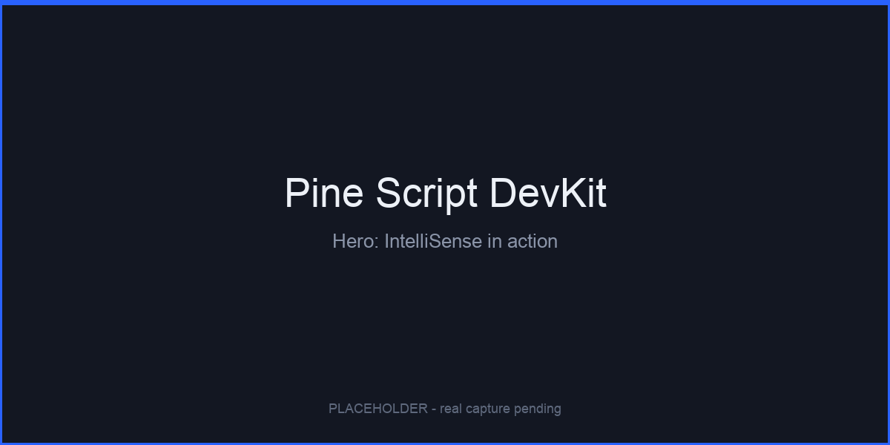
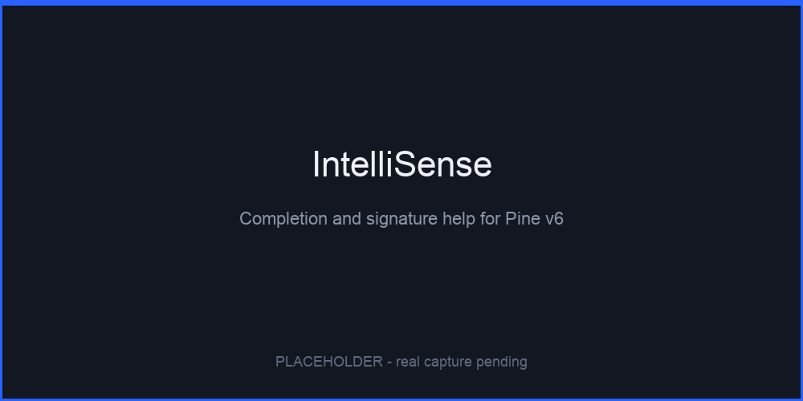
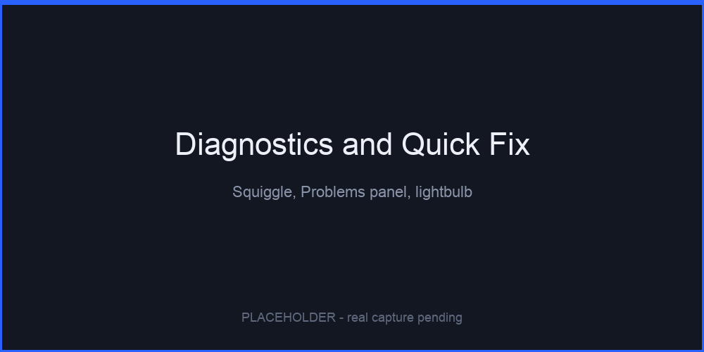
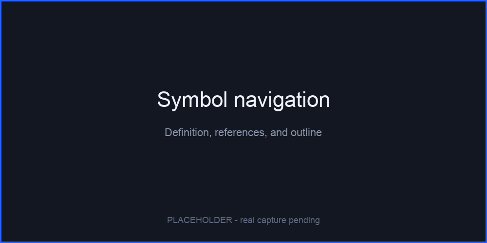
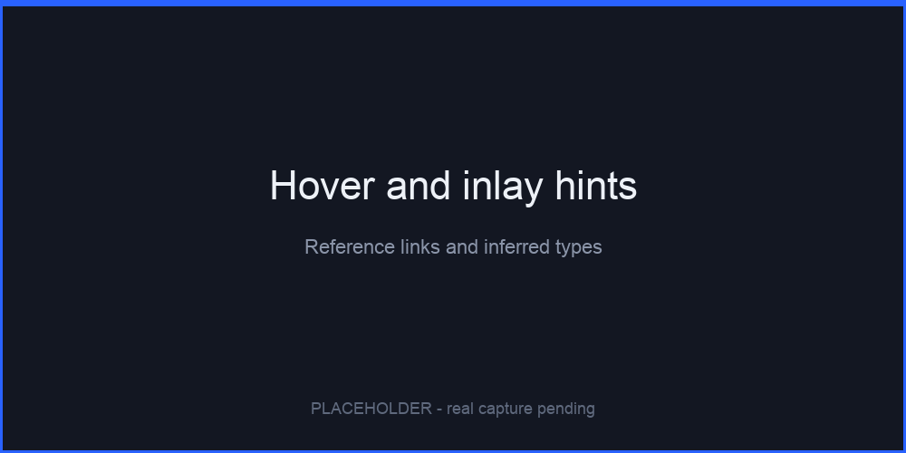

Build TradingView indicators, strategies, and libraries in VS Code with full Pine Script v6 language intelligence.

<!-- readme-badges:start -->

<!-- readme-badges:end -->

## Quick start

1. Install the extension, then open a folder with Pine Script files or open any `.pine` file.
2. Start typing `ta.`, `math.`, or `strategy.` to browse built-ins with inline documentation.
3. Create a script instantly: **Pine Script: New Indicator** (`⌘⌥I` / `Ctrl+Alt+I`) or **Pine Script: New Strategy** (`⌘⌥S` / `Ctrl+Alt+S`).

New to the extension? Run **Help: Open Walkthrough…** and pick **Get Started with Pine Script**.

## Write faster with complete Pine v6 IntelliSense

Stop hunting through documentation. Autocomplete, hover docs, and signature help cover every built-in function, variable, constant, and namespace in Pine Script v6, plus your own functions, types, parameters, and variables.

Hover any built-in and follow **View in Pine Script Reference** to open the official TradingView page. Semantic highlighting keeps your own symbols visually distinct from built-ins.

## Catch mistakes as you type

Real-time diagnostics flag missing or non-v6 `//@version` declarations, incomplete `indicator()` and `strategy()` configuration, import resolution problems, and common Pine pitfalls. Everything lands in the Problems panel, and quick-fix code actions repair the common cases in one click: add `//@version=6`, add `overlay=`, or wrap a block with `barstate.isconfirmed`.

## Find your way around any script

Land on the symbol you need without scrolling, even in an unfamiliar thousand-line strategy.

- **Symbol navigation**: Go to Definition (`F12`), Go to Type Definition, Find All References (`Shift+F12`), and Rename Symbol (`F2`)
- **Workspace symbols**: jump to any user-defined Pine symbol across your `.pine` files with `⌘T` / `Ctrl+T`
- **Outline and breadcrumbs**: functions, variables, user-defined types, and inputs at a glance
- **Code lens**: usage count above every user-defined function
- **Smart folding** for function bodies, `type` blocks, and `// #region` markers
- **Document links** on built-in call sites, the version header, and resolvable local imports

## Keep code clean without the busywork

Let the editor handle the mechanical work while inferred types and documentation stay in view.

- **Auto-formatter**: whole document, selection, or on-type. Normalizes 4-space indentation, trims trailing whitespace, collapses excess blank lines. Run it with **Pine Script: Format Document**, `Shift+Alt+F`, or the `pinescript.formatDocument` command.
- **40+ Snippets** covering indicator, strategy, and library scaffolds, TA patterns, control flow, drawing objects, and tables.
- **Inlay hints** show inferred types, the effective overlay value on `indicator()` and `strategy()` calls, and parameter names at call sites.
- **Color picker** for `#RRGGBB`, `color.rgb()`, and every `color.*` constant.
- **File templates** for new indicators and strategies; create libraries with the `library` snippet prefix.

## Imports and libraries

Local `import` paths resolve through the workspace, so Go to Definition and document links work on your own modules. Third-party `import Author/Lib/N` statements are always accepted and never flagged as unknown, and popular community libraries resolve automatically with member hover, completion, and signature help. For private or unresolved libraries, drop the source at `.pine-libs/Author/Lib/N.pine` in your workspace root. Unresolved third-party imports show a subtle hint, never a warning.

## AI Integration

Pine Script DevKit ships a `@pinescript` GitHub Copilot Chat participant and a set of **Language Model Tools** for Copilot Agent mode, all grounded in local Pine v6 metadata rather than guesswork.

Ask `@pinescript` to explain selected code, or use `/explain`, `/indicator`, and `/strategy` to generate scaffolds. In Agent mode the tools `#lookupBuiltin`, `#searchBuiltins`, `#getDiagnostics`, `#workspaceDiagnostics`, `#scaffold`, `#applyScaffold`, and `#suggestFix` become available when a `.pine` file is in context. Bundled chat instructions, prompt files, and the **pine-indicator** skill attach automatically.

**Model Context Protocol server.** On VS Code desktop the extension registers a local MCP server named `pine-script-devkit`, so any MCP-capable assistant in the same window discovers the same Pine tools under their `pinescript_*` names. It listens on loopback only. Toggle it with `pinescript.mcp.enable`. The MCP surface is desktop-only and unavailable in VS Code for the web.

**Other agents.** Run **Pine Script: Generate Agents Guidance** to write a managed Pine workflow section into `AGENTS.md` at your workspace root.

**Workspace Trust.** `@pinescript` requires Workspace Trust, and `#applyScaffold` additionally needs an open workspace folder. Core language features — syntax, IntelliSense, diagnostics, formatting, and navigation — keep working in **Restricted Mode**.

AI-generated code may be incomplete or inaccurate. Always review, test, and validate it in TradingView before relying on it.

## Settings

The most useful toggles, all under **Pine Script** in the VS Code Settings editor, where you will also find the complete list:

| Setting                               | What it does                                                         |
| ------------------------------------- | -------------------------------------------------------------------- |
| `pinescript.diagnostics.enable`       | Real-time diagnostics                                                |
| `pinescript.inlayHints.enable`        | Master switch for inlay hints                                        |
| `pinescript.workspaceSymbols.enable`  | Go to Symbol in Workspace for Pine symbols                           |
| `pinescript.inlineCompletions.enable` | Opt-in Pine ghost text, off by default so it never fights Copilot    |
| `pinescript.mcp.enable`               | Expose Pine tools to MCP-capable hosts, desktop only                 |
| `pinescript.hover.showDocLinks`       | TradingView reference links in hover, completion, and signature help |
| `pinescript.remoteLibraries.fetch`    | Fetch public third-party library sources for import IntelliSense     |

## Requirements

- VS Code 1.125.0 or higher
- GitHub Copilot Chat for `@pinescript` and Agent mode tools

## Platforms

Full language features, Copilot integration, and the MCP server run on VS Code desktop. The web extension on vscode.dev and github.dev provides language features and Copilot AI where trust allows, without the MCP server. Virtual and remote workspaces are supported; workspace-wide reference search is the one feature that is not available there.

## Localization

The extension UI is localized for 14 VS Code display languages, selected automatically by VS Code.

## Privacy and crash reporting

When VS Code telemetry is enabled and `telemetry.telemetryLevel` is not `off`, the desktop extension may send sanitized crash reports to [Sentry](https://sentry.io) EU ingest. Reports go to the extension author, not to Microsoft. The web extension host sends nothing.

Sent: error type and message with sensitive details removed, extension and VS Code versions, platform, stack traces, and anonymous release-health session data keyed by the anonymized `vscode.env.machineId` identifier so crash-free rates can be computed.

Never sent: your Pine Script source or document text, auth tokens, cookies, raw file paths, install events, performance tracing, session replay, or profiling. Tune it with `pinescript.telemetry.sentry.sampleRate`; changes apply immediately.

## Support

- **Questions**: [Marketplace Q&A](https://marketplace.visualstudio.com/items?itemName=chereshnyuk.chereshnyuk-com-pinescript)
- **Bugs and feature requests**: [GitHub Issues](https://github.com/chereshnyuk/vscode-extension-pinescript-feedback/issues)

If Pine Script DevKit helps your workflow, you can [buy me a coffee](https://buymeacoffee.com/chereshnyuk).

## Security

<!-- virustotal-trust:start -->

Each published VSIX is scanned with VirusTotal before Marketplace release for version 2.7.2.

Detections: 0/74. [View report on VirusTotal](https://www.virustotal.com/gui/file/3b6d852ac6637b765cbd4ba22e926c25d79247c704ce457f638443139c639a7a).

<!-- virustotal-trust:end -->

## Disclaimer

Pine Script DevKit is a software development tool for writing and maintaining Pine Script code. It does not provide investment advice, trading advice, or personalized financial recommendations, and it does not assess your financial circumstances, objectives, or risk tolerance.

Diagnostics, code actions, documentation, and AI integrations are provided for development and educational purposes only and may be incomplete or inaccurate. You are solely responsible for reviewing, testing, and backtesting any Pine Script code in TradingView before relying on it. Trading involves risk, including possible loss of capital; past and backtested performance does not guarantee future results.

This is an independent project, not affiliated with, endorsed by, or sponsored by TradingView. Provided under the MIT License; the warranty disclaimer and limitation of liability in the `LICENSE` file apply to the maximum extent permitted by law.

<!-- readme-badges:prerelease:start -->
<!-- virustotal-release-version:2.6.2 -->

<!-- readme-badges:prerelease:end -->
